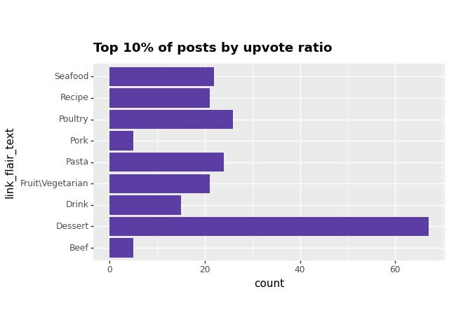

# DS105A-project-chadgpt 😎😎😎😎
Project Chadgpt

## 📋Team Members 
- Zicheng Liu (zcliu35) | BSc in Economics
- Yuyao Bai (yuyaobai) | BSc in Economics
- Clarence Quek (kurarensu77) | BSc in Economics
- Yi Song (songgyi) | BSc in Economics

## 🍗 Spicing Up Data: An Analytical Feast on r/recipe
As a student facing the challenges of independent living at LSE, have you experimented with any recipes shared on r/recipe? Better yet, have you actively added your own culinary creations to this subreddit? If you're navigating through the multitude of recipes available and seeking your ultimate go-to meal for tight budgets and busy schedules, look no further!

Having experienced the struggles firsthand, we're here to guide you in making informed decisions. Discover the most highly praised recipes on r/recipe and identify the ones with optimal nutritional value to create the ultimate go-to meals for your student journey. Whether you've been through it or are currently navigating it, we're here to assist you in choosing recipes that not only meet your taste preferences but also provide the essential nutrients needed for the best struggle meals ever!

### Our Data Source
- [r/recipe](https://www.reddit.com/r/recipes/)
- [BBC Good Food](https://www.bbcgoodfood.com/)

## 📋PROJECT Roadmap
to insert roadmap here

### ⚙️Project Hypothesis
We suggest a hypothesis that implies foods enjoying broad popularity, as evidenced by a high upvote ratio, may demonstrate reduced nutritional content. We aim to investigate and substantiate or refute this assertion through further exploration and analysis.

### ⚙️Roadmap Explation

## 📋General Outline
### 📖Part 1 (Initial Scraping and Cleaning)
- We started off with r/recipe, where we used reddit api to get the data that we wanted (title of post, date and time created, number of upvotes, upvote ratio, number of comments, url)
- Example of data frame received from reddit:
    - <iframe src="posts.html" style="width: 100%; height: 400px; border: 1px solid #ddd; border-radius: 5px; box-shadow: 2px 2px 5px #888;"></iframe>
    - We received around 2065 recipes from the Reddit API, containing basic details like links, upvote ratios, post flairs, and upvote counts. The dataframe is raw and needs cleaning, with redundant columns to be removed
- Prior to data cleaning, we accessed the original poster's comment, a crucial step as it contains the OP's recipe and ingredients list for us to testing our hypothesis.  
- Observation: We selected this subreddit under the assumption that its posts maintain a well-structured format regulated by moderators. However, some posts required data cleaning due to improper formatting or deletion.
Data Cleaning Steps:
    - Filtering out posts with non-English titles was achieved through a custom function called "Chadtools," leveraging the Langid package.
    - Conversion of data types to more efficient formats (such as from int64 to int16) was performed to enhance computational efficiency.
    - Posts dated before August 31, 2020, were excluded. This decision was influenced by r/recipes' implementation of stricter regulations from that date onwards, resulting in more consistently formatted posts.

- Filtered data set Example
    - <iframe src="df_filtered.html" style="width: 100%; height: 400px; border: 1px solid #ddd; border-radius: 5px; box-shadow: 2px 2px 5px #888;"></iframe>
    - In this dataset, we have most of the information we require for initial analysis of the posts. We will move on to ingredient and recipe analysis in conjunction with data from BBC in part 2.

### Part 1 📊Analysis
We analysed data from reddit and observed some trend on posts with different flairs!
- 
    - Remarkably, within the top 10% of posts ranked by upvote ratio, those labeled with the "dessert" flair exhibit the highest frequency. Notably, this occurrence surpasses the second-highest, "poultry," by more than half. It suggests a strong inclination among Reddit users towards favoring dessert-related posts.
- 
    Furthermore, an overarching observation across all posts reveals a conspicuous left skew in the distribution of upvote ratios. This skew suggests that a significant majority of posts tend to approach a ratio of 1. Such a pattern implies the existence of a community within this subreddit that is supportive and benevolent. Notably, this trend persists across individual flair categories in Reddit posts.

### 📖Part 2 (Further Scraping and Cleaning)
(to describe technical steps without too many details)
#### ⚙️Linking r/recipes and BBC Good Food 
Approach:
1. Obtain recipe titles and their respective nutritional data (calories, fat, fibre, sugar, protein etc) from BBC Good Food 
- Sent a GET request to https://www.bbcgoodfood.com/search?q= 
- Webscraping using a mixture of CSS and XPath selectors 

2. Calculating cosine similarity score and merging columns based on the maximum similarity  
- Employed a NLP model- Sentence Transformers- to convert each recipe title into an embedding
- Calculated the cosine similarity score between each pair of embeddings of Reddit and BBC Good Food recipe titles
    - The closer the cosine similarity score is to 1, the more similar the recipes titles
- Only retain the pairs where the cosine similarity score is above the threshold that we set (0.75), and these are considered matches
    - If there are multiple matches of different BBC Good Food titles to the same Reddit recipe title, we only keep the match with the highest cosine similarity score
- This approach yields 555 recipes with matches, a sufficient number for us to conduct further analysis
- Upon finding a match, we integrate additional details from the BBC Good Food dataset into our existing Reddit dataset
    - Includes nutritional information and user ratings scraped in Step 1 
    - (insert sample)

3. We now analyse the ingredients from Reddit posts using ChatGPT 3.5 to get a list of ingredient keywords. 

### Part 2 📊Analysis
- Present findings
<iframe src="interactive_plot.html" style="width:500px; height: 500px;"></iframe>

### 📖Overall Conclusion

### 📖Challenges

#### ❎Challenge 1
- Reddit's API limits a search query to 250 results only
    - To overcome this challenge, we iterated over a list of flair names for a specific subreddit and combining post data from each flair by extending a list!

#### ❎Challenge 2
- Extracting the OP's (original poster's) comment containing the actual recipe posed a challenge. While we could use one of the Reddit API Keys to target all OP's comments, we faced difficulties isolating the specific comment with the desired recipe.
    - To overcome this challenge, we made an assumption: The OP's comment we want will be LONGER 
    all other comments by the OP. Through this, we are able to target the OP's original comment with ingredients and instructions.

#### ❎Challenge 3
- Analysing the ingredient lists provided by OP on Reddit was difficult, as there was a lot of variance and there were no specific subreddit rules regarding the format of ingredient lists. The ingredients were often not well-formatted, making it difficult identify the exact ingredient using NLP. For instance, it was challenging to get Spacy or Regex to identify that the main ingredient in the line "1 clove of garlic, minced"  was "garlic". To overcome this challenge, we decided to use ChatGPT 3.5, as it is a very well-trained model that proved to be much better at identifying the primary ingredients mentioned by the OP.
(insert proof of Struggle using regex?)

## 📋Appendix
### 🔥🔥🔥🔥Contributions
- Zicheng Liu (zcliu35) 
    - Hard carried
- Yuyao Bai (yuyaobai)
    - Hard carried
- Clarence Quek (kurarensu77) 
    - got carried
- Yi Song (songgyi) 
    - got carried.....

