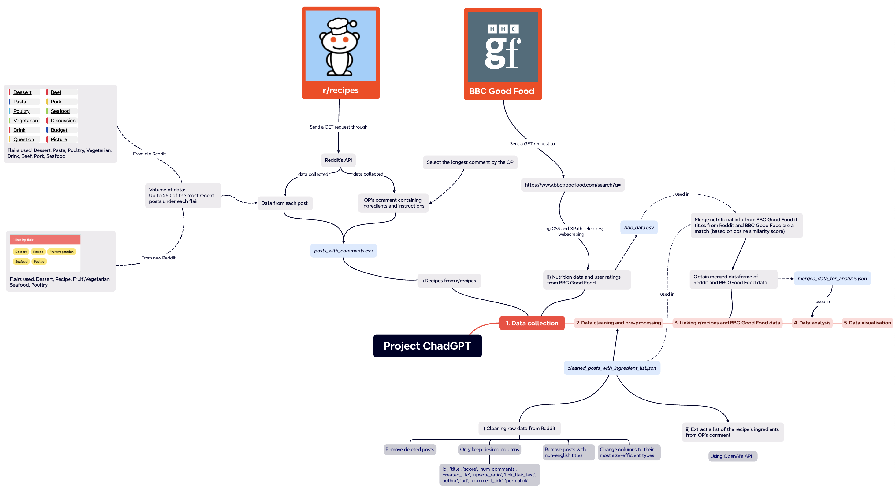
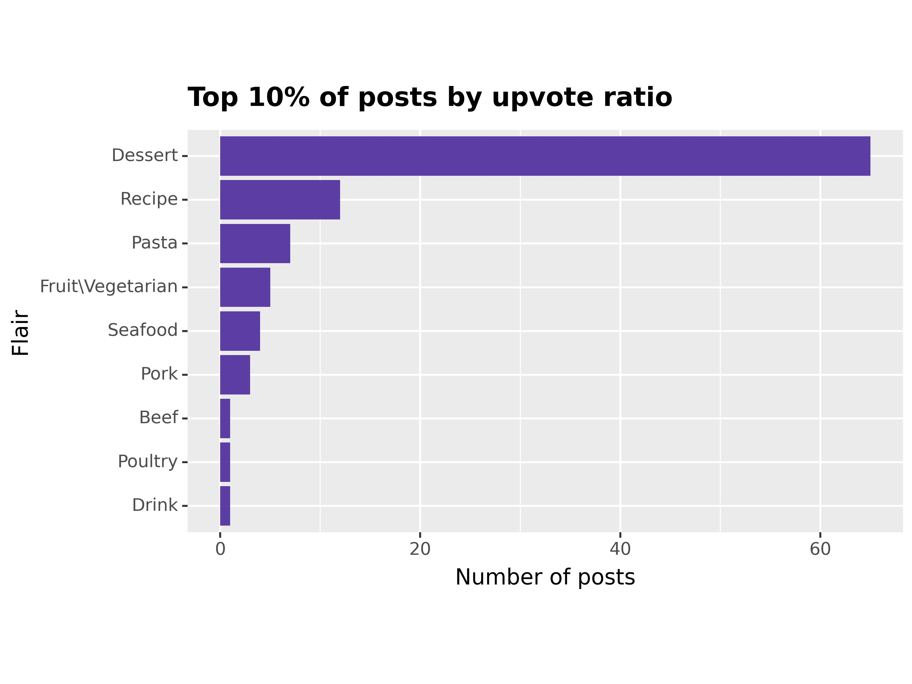
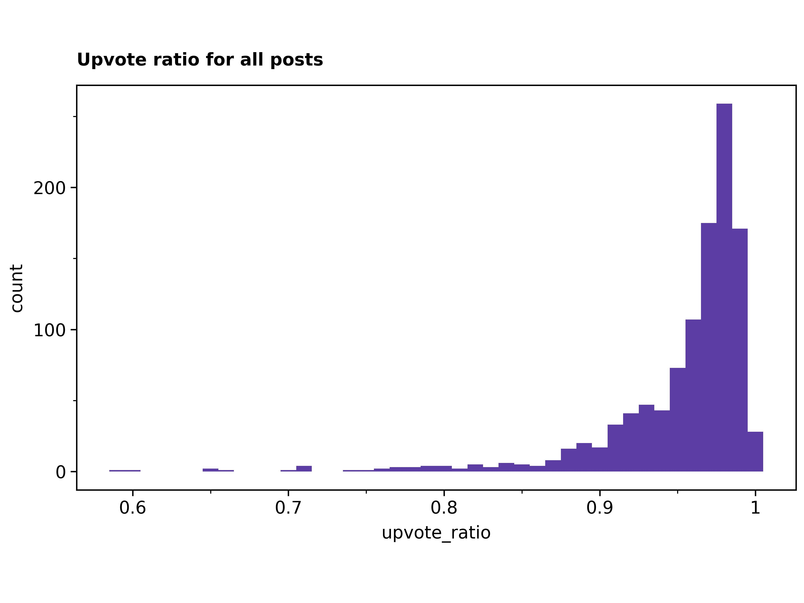
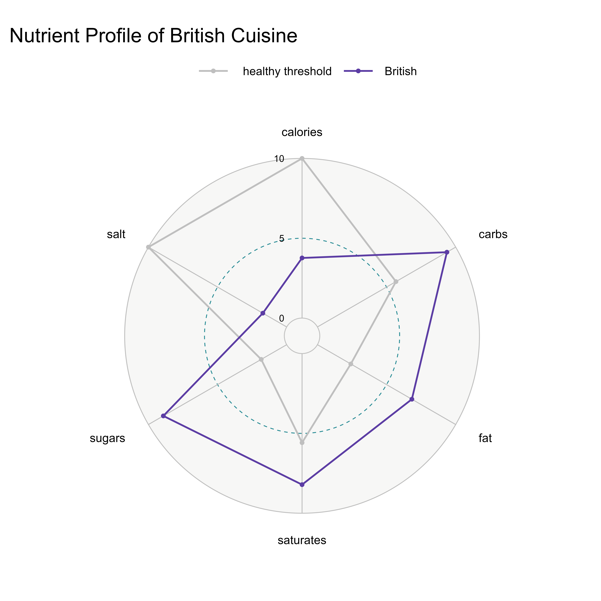
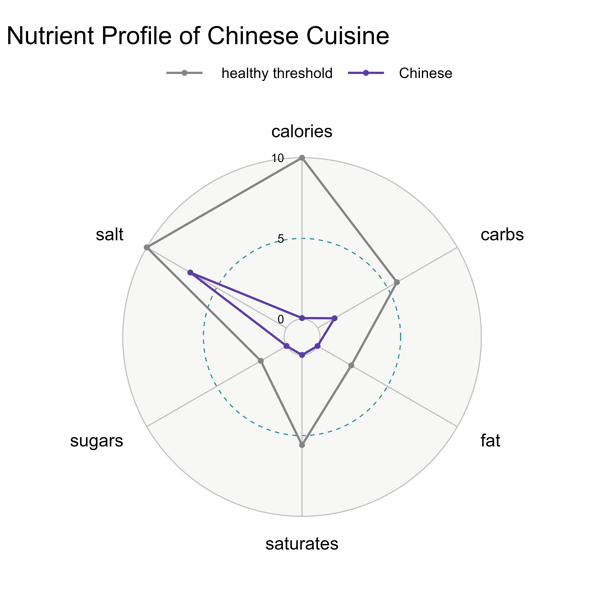
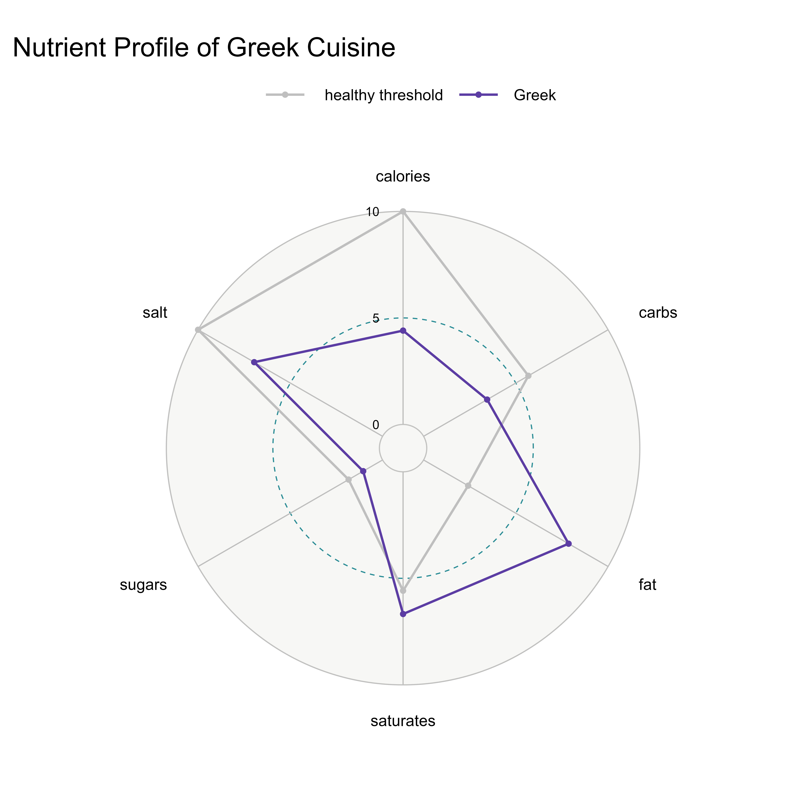
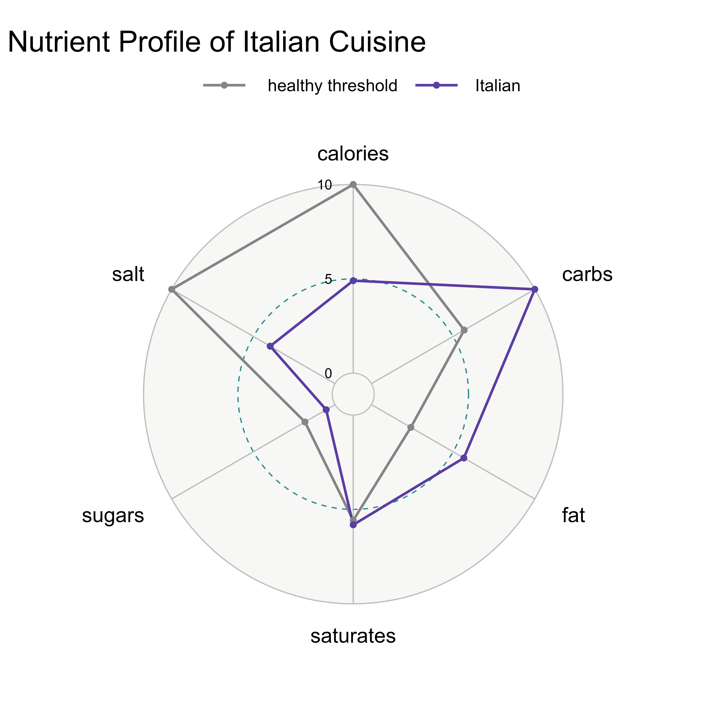
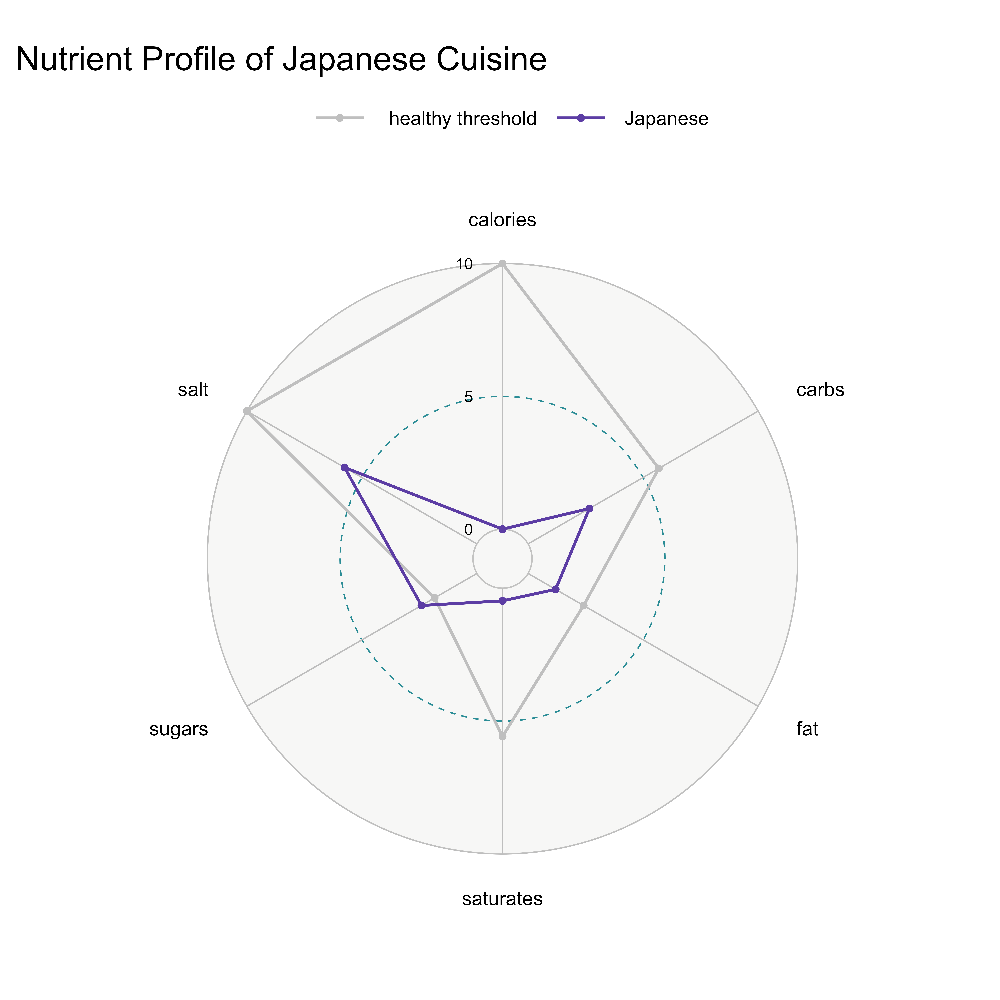
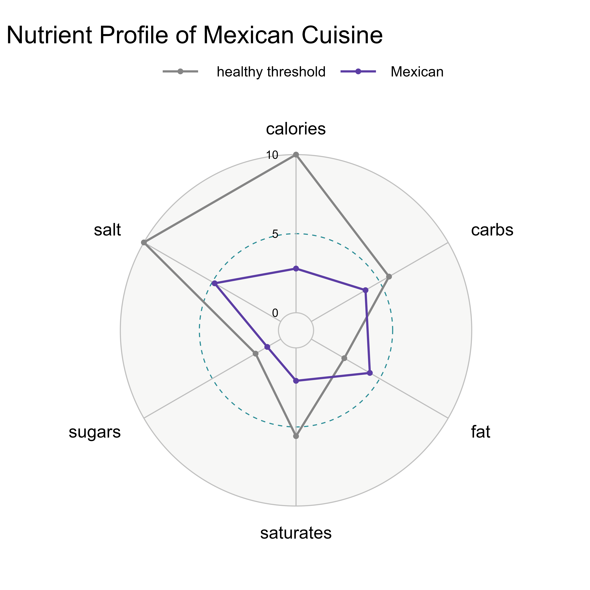
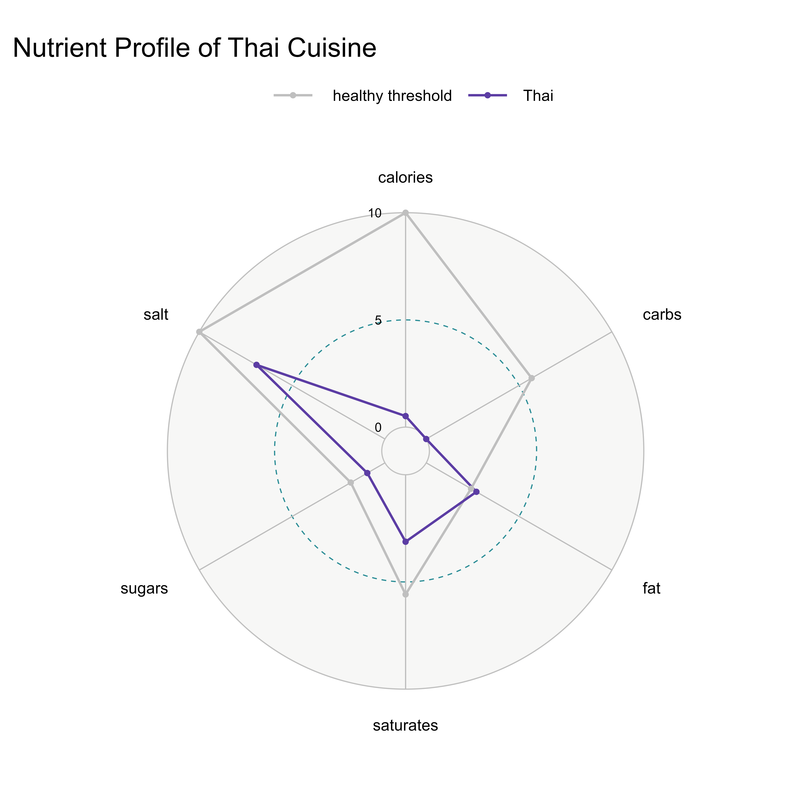

# DS105A-project-chadgpt 😎😎😎😎

Project **Chadgpt**

## 📋Team Members

-   Zicheng Liu (zcliu35) \| BSc in Economics
-   Yuyao Bai (yuyaobai) \| BSc in Economics
-   Clarence Quek (kurarensu77) \| BSc in Economics
-   Yi Song (songgyi) \| BSc in Economics

## 🍗 Spicing Up Data: An Analytical Feast on r/recipe

As a student facing the challenges of independent living at LSE, have you experimented with any recipes shared on r/recipe? Better yet, have you actively added your own culinary creations to this subreddit? If you're navigating through the multitude of recipes available and seeking your ultimate go-to meal for tight budgets and busy schedules, look no further!

Having experienced the struggles firsthand, we're here to guide you in making informed decisions. Discover the most highly praised recipes on r/recipe and identify the ones with optimal nutritional value to create the ultimate go-to meals for your student journey. Whether you've been through it or are currently navigating it, we're here to assist you in choosing recipes that not only meet your taste preferences but also provide the essential nutrients needed for the best struggle meals ever!

### Our Data Source

-   [r/recipes](https://www.reddit.com/r/recipes/)
-   [BBC Good Food](https://www.bbcgoodfood.com/)

### Motivation

Our project's origin story began on a Thursday night as the four of us gathered to brainstorm ideas before our DS105A class. Hungry and in need of a break, we ventured to a nearby chicken shop known for its delectable spicy sauce. Curious about its secret ingredients, we turned to Reddit for answers. To our delight, we stumbled upon a well-organized subreddit dedicated to culinary exploration. Inspired by our discovery, we decided to explore our findings on r/recipes and share with our fellow coursemates.

## 📋PROJECT Roadmap

### ⚙️Project Hypothesis

We suggest a hypothesis that implies **popular food**, as evidenced by a **high upvote ratio**, may demonstrate **reduced nutritional content**. We aim to investigate and substantiate or refute this assertion through further exploration and analysis.

## 📋General Outline

### 📖Part 1 (Initial Scraping and Cleaning)

-   We started off with r/recipe, where we used reddit api to get the data that we wanted (title of post, date and time created, number of upvotes, upvote ratio, number of comments, url)
-   Example of data frame received from reddit:
    -   <iframe src="posts.html" style="width: 100%; height: 400px; border: 1px solid #ddd; border-radius: 5px; box-shadow: 2px 2px 5px #888;">

        </iframe>

        Full data frame shape: 2065 x 113

    -   We received around **2065** recipes from the Reddit API, containing basic details like links, upvote ratios, post flairs, and upvote counts. The dataframe is raw and needs cleaning, with redundant columns to be removed
-   Prior to data cleaning, we accessed the original poster's comment, a crucial step as it contains the OP's recipe and ingredients list for us to testing our hypothesis.
-   Observation: We selected this subreddit under the assumption that its posts maintain a well-structured format regulated by moderators. However, some posts required data cleaning due to improper formatting or deletion.\
    Data Cleaning Steps:
    -   1️⃣ Filtering out posts with **non-English titles** was achieved through a custom function called "Chadtools", leveraging the Langid package.
    -   2️⃣ **Conversion** of data types to more efficient formats (such as from int64 to int16) was performed to enhance computational efficiency.
    -   3️⃣ Posts dated before August 31, 2020, were excluded. This decision was influenced by r/recipes' implementation of **stricter regulations from that date onwards**, resulting in more consistently formatted posts.
-   Example of the filtered data set 
    -   <iframe src="df_filtered.html" style="width: 100%; height: 400px; border: 1px solid #ddd; border-radius: 5px; box-shadow: 2px 2px 5px #888;">

        </iframe>

        Full data frame shape: 998 x 12

    -   In this dataset, we have most of the information we require for initial analysis of the posts.🤩 We will move on to ingredient and recipe analysis in conjunction with data from BBC Good Food in part 2.

### Part 1 📊 Initial Analysis of Reddit Data

We analysed data from reddit and observed some trends on posts with different flairs!  
   
- Remarkably, within the **top 10%** of posts ranked by **upvote ratio**, those labeled with the **"dessert"**🍦 flair exhibit the highest frequency. Notably, this occurrence surpasses the **second-highest**, **"poultry"**🍗 by more than half. It suggests a **strong inclination among Reddit users towards favoring dessert-related posts.** Our theory is that dessert posts fufil more dietary requirements and thus appeal to a larger audience base.   

   
- Furthermore, an overarching observation across all posts reveals a **conspicuous left skew**(longer tail on the left) in the distribution of upvote ratios. This skew suggests that a significant majority of posts tend to **approach a ratio of 1**. Such a pattern implies the existence of a community within this subreddit that is supportive and benevolent. Notably, this trend persists across individual flair categories in Reddit posts.

### 📖Part 2 (Further Scraping and Cleaning)

#### ⚙️Linking r/recipes and BBC Good Food

Approach:   
1. Obtain recipe titles and their respective nutritional data (calories, fat, fibre, sugar, protein etc) from BBC Good Food   
- Sent a GET request to https://www.bbcgoodfood.com/search?q=   
- Webscraping using a mixture of CSS and XPath selectors   
- Example of filtered nutritional information and user ratings scraped   
- <iframe src="bbc_data.html" style="width: 100%; height: 250px; border: 1px solid #ddd; border-radius: 5px; box-shadow: 2px 2px 5px #888"></iframe>   
    - Full data frame shape: 10011 x 11

2.  **Calculating cosine similarity score and merging columns based on the maximum similarity**  

-   Employed a NLP model - `sklearn's SentenceTransformers` - to convert each recipe title into an embedding
-   Calculated the cosine similarity score between each pair of embeddings of Reddit and BBC Good Food recipe titles
    -   The closer the cosine similarity score is to 1, the more similar the recipes titles
-   Only retain the pairs where the cosine similarity score is above the threshold that we set (0.75), and these are considered matches
    -   If there are multiple matches of different BBC Good Food titles to the same Reddit recipe title, we only keep the match with the highest cosine similarity score
-   This approach yields 467 recipes with matches, a sufficient number for us to conduct further analysis
-   Upon finding a match, we integrate additional details from the BBC Good Food dataset into our existing Reddit dataset
-   Example of merged dataframe between BBC Good Food and r/Recipes
    -   <iframe src="merged_data_for_analysis" style="width: 100%; height: 500px; border: 1px solid #ddd; border-radius: 5px; box-shadow: 2px 2px 5px #888;">

        </iframe>

        -   Full data frame shape: 467 x 20

#### Extracting Cuisine and Ingredients

- Used `GPT-3.5-turbo` via the OpenAI API to infer the cuisine and extract a list of basic ingredients for each recipe.

- Prompted GPT to identify the cuisine of the recipe and extract the ingredients, given a string containing the recipe.

- We decreased the temperature to ensure that GPT followed our prompts more closely and didn't get too "creative" with the answers

- We specified a seed value to ensure that the results were reproducible

### Part 2A 📊 Analysis of Merged Reddit and BBC Good Food Data

<iframe src="interactive_plot.html" style="width:100%; height:700px; border:none;">

</iframe>

The above plot shows that there is no clear relationship between the popularity of a recipe (using Reddit upvote ratio as a proxy) and the healthiness of a recipe (using calorie count as a proxy)-- this means that our initial hypothesis is incorrect! By choosing select flairs on the legend, we see that this lack of correlation holds regardless of the category of food that the recipe falls under. One possible reason for this lack of correlation is that the motivation behind upvoting may extend beyond the perceived healthiness of a recipe. Visual appeal, creativity, the story behind the recipe, or a desire to support the OP (Original Poster) can all influence upvotes more than nutritional content.  

We also made another interesting observation that many posts have exactly the same upvote ratio (down to 10 decimal places). The upvote ratio was also always close to a whole number (e.g. 0.9501963125). This could be due to normalisation or rounding errors on Reddit.
  
Follow the link on each point (using **cmd+click/ ctrl+click**) to find the recipe that is both well-received and meets your nutritional goals!   

<iframe src="upvote_ratio_vs_bbcgf_rating" style="width:100%; height:700px; border:none;">

</iframe>

We observe a strong association between higher Reddit upvote ratios and higher BBC Good Food ratings. One possible reason is that some recipes may have a universal appeal due to their taste or prevalance across many cuisines. These recipes naturally attract positive attention and higher ratings on platforms like BBC Good Food and similarly receive more upvotes on Reddit due to their broad appeal.

However, there are some interesting outliers.  
1. British Baked Cabbage with Cheese Casserole 
- This is the post with the lowest upvote ratio on Reddit, yet it has a relatively high BBC Good Food rating. 
- When we follow the link of this point on the plot and observe the Reddit post and comments for this recipe, we can tell that this post is likely a troll post. 
- However, the cosine similarity test is purely based on the titles (without contextual information from the comments to signal that this is a troll post), so the corresponding nutrition data and user ratings from BBC Good Food will be inaccurate.

2.  Easter Egg Blondies
-   This post has a high Reddit upvote ratio, yet it has the lowest BBC Good Food rating.
-   Investigating the corresponding [post](https://www.bbcgoodfood.com/recipes/easter-egg-blondies) on BBC Good Food, we can tell from the comments that the recipe is flawed, both in its procedure and quantities of ingredients, and does not produce a tasty dish.
-   This exposes an imperfection in our approach-- ingredients and cooking procedure have a huge impact on how well a post is received, despite the Reddit and BBC Good Food recipe titles being highly similar.

### Part 2B 📊 Analysis of extracted cuisine and ingredients
- We found the top 10 most common cuisines featured across Reddit and BBC Good Food. Interestingly, ...
- We also obtained the average nutritional data (calories, carbohydates, fat, salt, sugar, saturates) for each cuisine. After obtaining benchmark values for these data from BBC Good Food and NHS, we visualise this information in radar charts for easy comparison. We have excluded the protein and fibre values from the radar charts, as more protein and fibre are generally viewed as healthy unlike the other nutritional indicators, complicating our radar chart. (explain some cool findings)

<html lang="en">
<head>
<meta charset="UTF-8">
<meta name="viewport" content="width=device-width, initial-scale=1.0">
<title>Image Grid</title>

</head>
<body>

  

  

  

  

  

  

  

  

  

  

</body>
</html>

- Notably, Italian cuisine has the most calories, while Greek cuisine has the lowest calories. For the gymbros at LSE, they can consider cooking more XX cuisine for its high protein content and building muscle. 
blah blah blah

blah blah blah

- insert top 10 ingredient list
    - For all our fellow LSE students out there, when you move into your new accommodation next year, these 10 most-used ingredients are your move-in kitchen staples for you to become a meal prep monster!

### 📖Overall Conclusion
We observe that our initial hypothesis regarding the correlation between the healthiness of a recipe and its popularity was incorrect. On hindsight, our hypothesis was perhaps restricted in its perspective, as there are after all many other variables that affect the popularity of a post, such as the aesthetics or story behind the post, or even the algorithm behind the post.

### 📖Challenges

#### ❎ 1: Reddit API Limits

-   Reddit's API limits a search query to 250 results only
    -   To overcome this challenge, we iterated over a list of flair names for a specific subreddit and combining post data from each flair by extending a list!

#### ❎ 2:Extracting Reddit recipes and ingredients

-   Extracting the OP's comment containing the actual recipe posed a challenge. While we could use one of the Reddit API Keys to target all OP's comments, we faced difficulties isolating the specific comment with the desired recipe.
    -   To overcome this challenge, we made an assumption: The OP's comment we want will be LONGER all other comments by the OP. Through this, we are able to target the OP's original comment with ingredients and instructions.

#### ❎ 3: Analysing Reddit recipes and ingredients

-   Analysing the ingredient lists provided by OP on Reddit was difficult, as there was a lot of variance and there were no specific subreddit rules regarding the format of ingredient lists. The ingredients were often not well-formatted, making it difficult identify the exact ingredient using NLP. For instance, it was challenging to get Spacy or Regex to identify that the main ingredient in the line "1 clove of garlic, minced" was "garlic". To overcome this challenge, we decided to use ChatGPT 3.5, as it is a very well-trained model that proved to be much better at identifying the primary ingredients mentioned by the OP. (insert proof of Struggle using regex?)

## 📋Appendix

### 🔥🔥🔥🔥Contributions

-   Zicheng Liu (zcliu35)
    -   Hard carried
-   Yuyao Bai (yuyaobai)
    -   Hard carried
-   Clarence Quek (kurarensu77)
    -   got carried
-   Yi Song (songgyi)
    -   got carried.....

### 🔎References
- [BBC Good Food Guide to Healthy Eating](https://www.bbcgoodfood.com/howto/guide/good-food-guide-healthy-eating)
- [NHS Eatwell Guide](https://www.nhs.uk/live-well/eat-well/food-guidelines-and-food-labels/the-eatwell-guide/)
